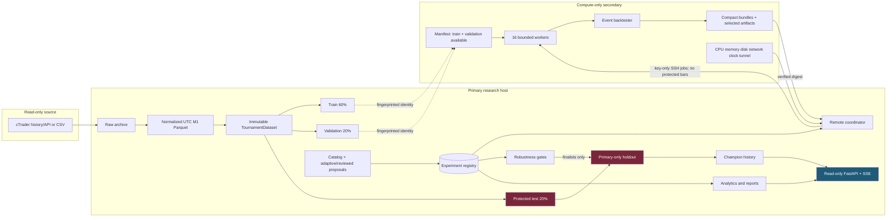
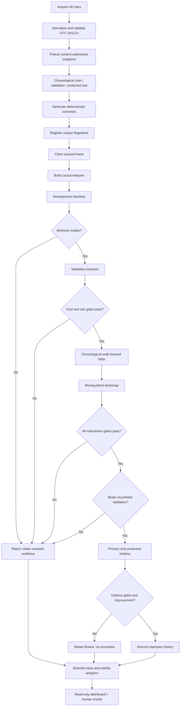
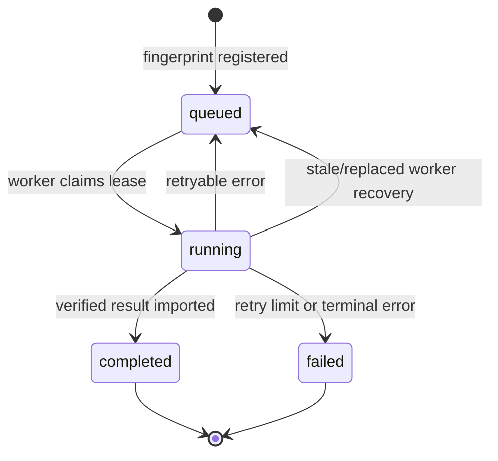

# XAUUSD Research Tournament

An offline, research-only platform for testing XAUUSD one-minute strategies at scale. It freezes reproducible historical data, generates deterministic experiments, runs cost-aware train/validation backtests locally or on secondary compute, applies chronological robustness gates, and retains every attempt for audit.

> [!IMPORTANT]
> This is not a trading bot. It has no broker order connector, cannot activate live trading, and makes no profitability promise. Protected holdout data stays on the primary host.

Production dashboard: [https://xau.aims-sg.com/](https://xau.aims-sg.com/)

## Contents

- [Capabilities and boundaries](#capabilities-and-boundaries)
- [Architecture](#architecture)
- [Research workflow](#research-workflow)
- [Scenario lifecycle](#scenario-lifecycle)
- [Data and reproducibility](#data-and-reproducibility)
- [Strategies and mixtures](#strategies-and-mixtures)
- [Backtesting and validation](#backtesting-and-validation)
- [Distributed execution](#distributed-execution)
- [Results and observability](#results-and-observability)
- [Installation](#installation)
- [Configuration](#configuration)
- [Command reference](#command-reference)
- [Production and operations](#production-and-operations)
- [Safety, testing, and parity](#safety-testing-and-parity)
- [Repository map](#repository-map)
- [Known limits](#known-limits)

## Capabilities and boundaries

The platform provides:

- Immutable, content-addressed XAUUSD M1 data with chronological train, validation, and protected-test partitions.
- Deterministic scenario fingerprints and duplicate prevention.
- Thirteen causal strategy families with strategy and execution parameter grids.
- Next-bar, cost-aware event simulation with spread, slippage, commission, stops, targets, time exits, and conservative intrabar ordering.
- Local and bounded SSH-distributed execution with retries, recovery, circuit breaking, drain/resume, and backpressure.
- Walk-forward and seeded moving-block-bootstrap validation.
- Multiple-testing, parameter-stability, gate-failure, adaptive-search, ML-governance, portfolio, regime, and loss-source analytics.
- Compact results for every new trial and selective detailed-ledger retention.
- A read-only FastAPI dashboard updated through Server-Sent Events.

It does not place, modify, or cancel orders; expose dashboard mutation endpoints; send protected bars to secondary compute; promote on one metric; or treat positive P&L as proof of future profitability.

## Architecture

The primary owns orchestration, the registry connection, the complete frozen dataset, protected-holdout evaluation, reporting, and the dashboard. The secondary receives fingerprinted train/validation jobs, runs 16 bounded workers, and returns digest-verified bundles.



Registry selection:

- With `DATABASE_URL`: PostgreSQL-compatible backend. Production currently uses CockroachDB with `read_committed` isolation.
- Without `DATABASE_URL`: SQLite at `data/experiments/registry.sqlite3`, using WAL and foreign keys.

Do not run two authoritative registries for one tournament.

## Research workflow



No champion is currently promoted. Live trading remains disabled regardless of research status.

## Scenario lifecycle



Every row retains identity, formula and parameters, dataset/engine/cost versions, code commit, worker ownership, timestamps, status, retry/failure information, metrics, validation, artifact locations, and promotion state. An event table records lifecycle and operational actions.

The schema reserves a `cancelled` terminal status, but no public cancellation command or dashboard mutation route is currently exposed.

The SHA-256 scenario fingerprint is computed from canonical JSON containing the strategy family/formula, parameters, dataset identity, engine version, and cost-model version. Database uniqueness prevents duplicate registration.

## Data and reproducibility

```text
data/raw/ctrader/                  archived source data
data/processed/XAUUSD_M1.parquet  normalized UTC M1 history
data/tournaments/<version>/       immutable snapshot and manifest
data/tournaments/active.json      active snapshot pointer
```

`TournamentDataset` hashes canonical timestamps, schema, dtypes, and values independently of Parquet bytes. Invariants include sorted UTC timestamps, no duplicate index or null values, chronological non-overlapping partitions, read-only snapshot files, and primary-only protected data.

```bash
.venv/bin/python -m xauusd.cli data download --start 2025-08-01
.venv/bin/python -m xauusd.cli data validate
.venv/bin/python -m xauusd.cli tournament-data create
.venv/bin/python -m xauusd.cli tournament-data verify
.venv/bin/python -m xauusd.cli tournament-data status
```

Never fabricate or silently repair missing market data. Correct the source or reject the snapshot.

## Strategies and mixtures

| Family | Research idea |
|---|---|
| `mean_reversion` | Fade rolling price z-score extremes. |
| `momentum` | ATR-normalized fast/slow EMA edge. |
| `breakout` | Causal rolling-channel breaks. |
| `micro_trend` | Short-horizon normalized EMA strength. |
| `volatility_expansion` | Directional expanded-range candles. |
| `session_momentum` | Return direction in a UTC session. |
| `regime_switch` | Trend in strong regimes, reversion otherwise. |
| `autocorrelation_regime` | Follow/fade based on rolling autocorrelation. |
| `multi_horizon_momentum` | Fast/slow return agreement. |
| `quantile_reversion` | Fade causal return-tail quantiles. |
| `volatility_adjusted_trend` | Return normalized by rolling volatility. |
| `trend_pullback` | Pullbacks aligned with measured trend. |
| `confirmed_breakout` | Channel, volatility, and trend confirmation. |

Most families support both/long/short modes. Execution grids vary stop, target, and maximum holding bars. Adaptive mutations and constrained proposals use the same fingerprint and validation contract.

`PortfolioResearch` compares equal, inverse-volatility, and correlation-penalized weights using an earlier validation fit segment and a later evaluation segment. It reports best-individual/no-trade baselines, correlations, effective bets, exposure, Expected Shortfall, and leave-one-out contribution. Mixtures cannot promote or trade.

## Backtesting and validation

Signals target positions in `{-1, 0, 1}`. A close-observed signal executes no earlier than the next open. The engine models two-sided spread/slippage, two-sided commission, configurable XAU quantity, stops/targets, holding limits, conservative stop-first same-bar ambiguity, deterministic liquidation, ledgers, and equity.

Compact metrics cover net/pre-cost P&L, execution and commission costs, turnover, cost ratio, CAGR, Sharpe, Sortino, maximum drawdown, profit factor, expectancy, win rate, trade count, holding time, exposure, trade Expected Shortfall, and profit concentration.

Hard gates include minimum trades, positive post-cost expectancy/net profit, profit factor, drawdown, walk-forward consistency, and seeded dependence-aware bootstrap loss/P&L limits. A score never overrides a failed gate.

Selection-control reports include full trial/score distributions, Bonferroni warnings, Benjamini–Hochberg only with valid p-values, aligned-fold PBO, parameter-neighbor surfaces, isolated peaks, gate failures, near-passes, and measured loss-source attribution. These reports do not read the holdout.

ML uses chronological splits, causal features, calibration/drift checks, simple baselines, seeds, abstention, and no-trade fallback. Reused evaluation segments are non-promotion-eligible. An LLM is never a price oracle; Codex proposals are review-only.

## Distributed execution

The coordinator claims an owned lease, uploads a JSON job, runs the remote process, verifies protocol/fingerprint/dataset/digest, imports results, and completes or requeues that lease. The secondary never opens the primary registry.

Controls include bounded concurrency, stage timestamps, scenario retry limits, structured failure codes, circuit breaking, drain/resume, stale-worker recovery, persistent result storage, disk backpressure, and CPU/memory/disk/network/SSH/tunnel/clock telemetry. Clock or warning-level storage produces `DEGRADED`; critical storage produces `RESOURCE_EXHAUSTED` and suppresses claims.

## Results and observability

Every scenario retains compact JSON. Detailed `trades.csv.gz` and `equity.parquet` are preserved for validation passes/near-passes, deterministic audit samples, finalists, and other protected cases. Artifact fetches are restricted to allow-listed filenames and validated roots. Historical compaction is plan-digest-locked, journaled, resumable, and reconciled.

```text
reports/tournament/distributed/status.json
reports/tournament/distributed/results/<id>/result.json
reports/tournament/weekly/latest.json
reports/tournament/adaptive.json
reports/tournament/portfolio/latest.json
backups/tournament/
```

The dashboard has read-only GET endpoints. With dashboard credentials configured, APIs use HTTP Basic authentication; `/health` remains public. One `/api/live` SSE stream carries registry counts, leaders, primary/secondary resources, workers/stages, throughput/ETA, circuit/readiness, clock, retries/errors, and research reports.

```bash
.venv/bin/python -m xauusd.cli operations health
.venv/bin/python -m xauusd.cli operations scaling-checkpoint
.venv/bin/python -m xauusd.cli experiments summary
.venv/bin/python -m xauusd.cli remote-coordinator status
systemctl status xauusd-remote-coordinator.service --no-pager
journalctl -u xauusd-remote-coordinator.service -n 100 --no-pager
```

## Installation

Python 3.12+ is required. Linux is recommended for production.

```bash
git clone https://github.com/AegisFintech/xauusd.git
cd xauusd
python3 -m venv .venv
.venv/bin/python -m pip install --upgrade pip
.venv/bin/python -m pip install -e '.[dev]'
cp .env.example .env
chmod 600 .env
.venv/bin/python -m pytest -q
```

Start a local-only dashboard:

```bash
.venv/bin/python -m uvicorn xauusd.dashboard:app --host 127.0.0.1 --port 8080
```

`./start.sh` installs editable code and binds all interfaces; use it only when that exposure is intended.

## Configuration

| Variable group | Purpose |
|---|---|
| `CTRADER_*` | Read-only historical data credentials/account. |
| `DASHBOARD_*`, `PORT` | API authentication and dashboard port. |
| `DATABASE_URL` | Active PostgreSQL-compatible registry; omit for SQLite. |
| `DATABASE_URL_DIRECT` | Direct administration/migration endpoint. |
| `DATABASE_TRANSACTION_ISOLATION` | `read_committed` or `serializable`. |
| `COCKROACH_*` | Cluster metadata and CA path. |
| `COMPUTE_HOST/PORT/USER/SSH_KEY` | Key-only secondary SSH connection. |
| `COMPUTE_ROOT`, `COMPUTE_RESULT_ROOT` | Deployed code and persistent artifacts. |
| `COMPUTE_WORKERS` | Bounded workers; keep 16 absent new evidence. |
| `COMPUTE_MAX_RETRIES`, `COMPUTE_CIRCUIT_*` | Failure containment. |
| `COMPUTE_DISK_*`, `COMPUTE_CLOCK_WARNING_SECONDS` | Readiness thresholds. |
| `COMPUTE_DRAIN_PATH` | Graceful drain control. |
| `COMPUTE_ARTIFACT_AUDIT_PERCENT` | Deterministic detail sample. |

Keep `.env` at mode `0600`; never print, stage, log, or return credentials. Keep database CA files outside Git. Rotate exposed secrets.

Docker Compose parses `$` for variable substitution. Escape literal dollar signs as `$$` in a Compose-specific environment file, or preferably provide sensitive values through a runtime secret mechanism. The production systemd services read `.env` directly and do not use Compose interpolation.

## Command reference

### Data and experiments

```bash
.venv/bin/python -m xauusd.cli data import export.csv
.venv/bin/python -m xauusd.cli data update --overlap-minutes 10
.venv/bin/python -m xauusd.cli experiments catalog
.venv/bin/python -m xauusd.cli experiments seed-catalog --limit 1000
.venv/bin/python -m xauusd.cli experiments summary
.venv/bin/python -m xauusd.cli experiments list --status completed --limit 20
.venv/bin/python -m xauusd.cli tournament-worker --count 1
```

### Coordinator

```bash
.venv/bin/python -m xauusd.cli remote-coordinator
.venv/bin/python -m xauusd.cli remote-coordinator status
.venv/bin/python -m xauusd.cli remote-coordinator drain
.venv/bin/python -m xauusd.cli remote-coordinator resume
```

Drain before coordinator/worker maintenance and wait for `state: drained`, `active: 0`.

### Research and operations

```bash
.venv/bin/python -m xauusd.cli backtest --strategy momentum
.venv/bin/python -m xauusd.cli research
.venv/bin/python -m xauusd.cli validate-strategy --strategy mean_reversion --bootstrap-samples 500
.venv/bin/python -m xauusd.cli ml-research --threshold 0.58
.venv/bin/python -m xauusd.cli ml-walk-forward --threshold 0.58
.venv/bin/python -m xauusd.cli adaptive-analytics
.venv/bin/python -m xauusd.cli tournament-weekly-report
.venv/bin/python -m xauusd.cli operations backup
.venv/bin/python -m xauusd.cli operations scaling-checkpoint
.venv/bin/python -m xauusd.cli shadow status
```

Remote compaction uses separate plan/apply/reconcile commands with an exact digest and journal. Review `xauusd/operations.py` and the audit first; never improvise destructive paths.

## Production and operations

Templates under `deploy/systemd/` cover the remote coordinator, legacy local tournament, data update, daily research, weekly report, and backup timers. The installed dashboard unit may include host-specific drop-ins. Keep `xauusd-tournament.service` disabled while remote compute is authoritative.

Deployment workflow:

1. run focused tests, full tests, and `git diff --check`;
2. commit and push;
3. drain and wait for zero leases;
4. sync only required tracked code;
5. restart only the relevant service;
6. resume and verify a fresh zero-failure canary;
7. update the audit and push.

For disconnections, check operations health/status, key-only SSH, coordinator journal/failure code, remote `sg-tunnel.service`, DNS/TCP/routes, mounts and clock, then protocol/fingerprint/digest and circuit state. Do not change credentials without `AUTH_FAILURE` evidence.

Run scaling checkpoints at 50k, 100k, 250k, and 500k. Compare throughput, duration percentiles, stage time, CPU/memory/disk/network, retries, failures, duplicates, ETA, and storage. The present 16-core secondary is CPU-bound and cannot meet a one-day 500k target without measured horizontal capacity.

## Safety, testing, and parity

Safety is structural and tested: no broker connector, no mutating application routes, shadow readiness always false, explicit activation false, stale shadow data forces flat, emergency stop forces flat, compute cannot read `test`, result fetch paths are restricted, and holdout requires primary-side finalist gates.

```bash
.venv/bin/python -m pytest -q
git diff --check
```

Tests cover causal timing, accounting, intrabar ambiguity, deterministic execution, dataset fingerprints, chronology, bootstrap, registry ownership, retries, distributed protocol, artifacts, dashboard authentication/read-only behavior, ML governance, portfolio chronology, scaling, and disabled execution.

Golden checks have shown exact local/secondary metrics for momentum and mean-reversion. The retained momentum fixture also matched all trades and equity values. A secret-free deterministic engine fixture matches exactly between the local venv and runtime container. Separate staging parity and a second-family detailed comparison remain unverified.

The runtime image is built from `python:3.12.11-slim-bookworm`, copies only declared package/runtime files, runs as an unprivileged user, and excludes secrets, data, reports, logs, certificates, keys, caches, and build metadata from its context. Compose binds the dashboard to loopback by default, allow-lists environment variables, drops all capabilities, enables `no-new-privileges`, and uses a read-only root filesystem. Run the secret-free engine parity fixture with:

```bash
.venv/bin/python tests/container_parity.py > /tmp/parity-local.json
docker build -t xauusd-research:parity .
docker run --rm --network none --read-only --tmpfs /tmp:rw,noexec,nosuid,size=64m \
  --cap-drop ALL --security-opt no-new-privileges \
  -v "$PWD/tests/container_parity.py:/tmp/container_parity.py:ro" \
  xauusd-research:parity python /tmp/container_parity.py > /tmp/parity-container.json
cmp /tmp/parity-local.json /tmp/parity-container.json
```

## Repository map

| Path | Responsibility |
|---|---|
| `xauusd/data.py` | cTrader acquisition/import and normalization. |
| `xauusd/tournament_data.py` | Immutable snapshots and fingerprints. |
| `xauusd/research.py`, `search_space.py` | Causal strategies and deterministic grids. |
| `xauusd/engine.py` | Event simulation, costs, ledger, and metrics. |
| `xauusd/validation.py`, `tournament_runner.py` | Gates, walk-forward, bootstrap, holdout. |
| `xauusd/experiment_registry.py` | SQLite/PostgreSQL-compatible state/events. |
| `xauusd/distributed_compute.py` | SSH jobs, telemetry, retry, recovery, artifacts. |
| `xauusd/adaptive_search.py`, `strategy_proposals.py` | Search extensions and provenance. |
| `xauusd/codex_workflow.py` | Review-only proposal workflow. |
| `xauusd/portfolio_research.py` | Mixtures and regimes. |
| `xauusd/ml.py`, `ml_campaign.py` | Governed ML research. |
| `xauusd/weekly_report.py` | Gates, multiplicity, and stability analytics. |
| `xauusd/operations.py` | Health, backup, scale, retention, compaction. |
| `xauusd/shadow_trading.py` | Hard-disabled observation-only mode. |
| `xauusd/dashboard.py` | Read-only FastAPI/SSE UI. |
| `deploy/systemd/`, `tests/` | Deployment templates and contracts. |

See [Architecture](docs/ARCHITECTURE.md), the [discovery and scaling audit](docs/DISCOVERY_AND_SCALING_AUDIT_2026-08-19.md), and [agent operating rules](AGENTS.md).

## Known limits

- Single-secondary throughput is below the one-day 500k target.
- Fixed configured spread/slippage/commission is not realized broker microstructure.
- Swap, partial fills, rejected orders, and tick-level intrabar order are not fully modeled.
- Correlated trials limit simple multiple-testing interpretations.
- There is no promoted champion or live authorization.
- Cloud monetary cost, separate staging parity, and provider credential policy remain unverified.
- This software is research infrastructure, not financial advice.
