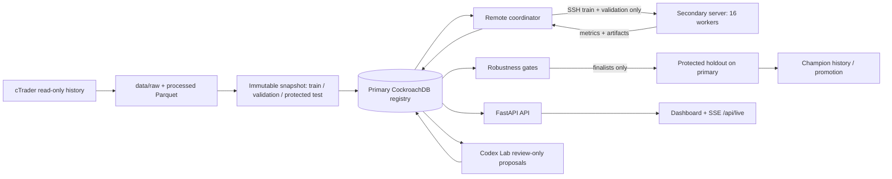

# Architecture and data-flow map

## Component map

| Path | Responsibility |
|---|---|
| `xauusd/data.py` | cTrader adapter, archive, normalization, validation |
| `xauusd/tournament_data.py` | immutable snapshot and fingerprints |
| `xauusd/engine.py` | event-driven execution, costs, stops/targets, ledger |
| `xauusd/research.py`, `search_space.py` | causal features, strategy families, catalog |
| `xauusd/tournament_runner.py` | lifecycle and backtest reconstruction |
| `xauusd/experiment_registry.py` | CockroachDB state, events, gates, champions |
| `xauusd/distributed_compute.py` | SSH bridge, workers, telemetry, artifacts |
| `xauusd/validation.py` | walk-forward, sensitivity, bootstrap gates |
| `xauusd/adaptive_search.py`, `strategy_proposals.py` | replenishment and novelty |
| `xauusd/codex_workflow.py` | constrained Codex workflow |
| `xauusd/dashboard.py` | authenticated API, SSE stream, UI |
| `deploy/systemd/` | production service templates |
| `tests/` | subsystem contracts |

## State and live UI

Stale or remote-error jobs are requeued with an auditable event. Artifacts remain remote until the dashboard requests allow-listed equity/trade files. One browser EventSource connection receives snapshots containing registry counts, champions, resources, secondary telemetry, worker stages, throughput, logs, and Codex status; charts and tables update in memory without polling.
