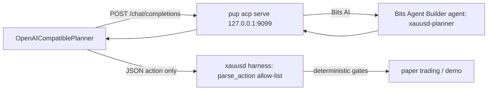

# Feasibility: replace the planner LLM endpoint with a Datadog Bits AI agent

Date: 2026-09-22 (Asia/Shanghai)

Scope: feasibility study only. No code, deployment, or `.env` changes were made by this
document. All proposed work is tracked as follow-up actions below.

Evidence labels: **confirmed** means observed in repository code or in the referenced
Datadog documentation at the time of writing; **hypothesis** means it requires the stated
spike/test; **not yet verified** means the evidence was unavailable. Credentials were never
printed.

## 1. Context and goal

The autonomous agent's planner currently calls an OpenAI-compatible HTTP gateway:

| Env var | Current value (`.env`) |
|---|---|
| `OPENAI_BASE_URL` | `https://models.kapon.cloud/v1` |
| `OPENAI_MODEL` | `grok-4.6` |
| `OPENAI_TIMEOUT_SECONDS` | `90` |

That endpoint's quota is exhausted. The goal is to keep the agent reasoning by routing the
planner to a **Datadog Bits AI agent** dataset instead, without weakening any of the
repository's deterministic safety gates.

## 2. Feasibility verdict

**Viable as an OpenAI-compatible drop-in, gated on one prototype test.** The natural
integration path uses Datadog's **Pup CLI** local server (`pup acp serve`), which exposes
exactly the `POST /chat/completions` protocol the planner already speaks, proxying to a
Bits Agent Builder agent. No planner protocol rewrite is needed; only a small `.env`
change, a single auth-code relaxation, and ops plumbing.

**The decisive risk is contract fidelity, not connectivity.** Bits agents are agentic and
return natural language. If the dedicated Bits agent does not reliably reply with *exactly*
one JSON action object, every planner call becomes a `planner_error` tick. That failure is
fail-safe (see §6), but it would also mean the pilot is not production-usable. The
prototype gate in §8 exists to settle this before any cutover.

## 3. Where the planner is wired today (confirmed)

- `OpenAICompatiblePlanner` — `xauusd/autonomous_harness.py:151`.
  - `from_env()` requires a non-empty `OPENAI_API_KEY` (`autonomous_harness.py:160`) — this
    is the only code that must change.
  - `_request()` posts `{base_url}/chat/completions` with `Authorization: Bearer <key>`,
    `Content-Type: application/json`, and a browser-grade `User-Agent`
    (`autonomous_harness.py:199-205`). The browser `User-Agent` exists for the Cloudflare-WAF
    front of `models.kapon.cloud`; it is harmless against a local Pup server but must not be
    dropped while the cloud gateway remains a fallback target.
  - `_payload()` sends a system prompt enforcing the JSON action contract plus the goal,
    tool definitions, and evidence, with `response_format: {"type":"json_object"}` and
    `temperature: 0` (`autonomous_harness.py:192-197`).
  - `plan_with_raw()` reads `choices[0]["message"]["content"]` and parses/validates it via
    `parse_action()` against the tool allow-list (`autonomous_harness.py:129-190`). Model
    output is untrusted data end to end.
- Tick loop — `xauusd/agent_loop.py:518` (`run_tick`). Per tick (default `poll_seconds=60`,
  `max_steps_per_tick=4`): 1 planner call minimum, up to 5. The market-closed gate and the
  market-data-freshness gate run *before* any planner call (`agent_loop.py:523-561`), so a
  Bits-backed planner can never consume tokens or induce orders while the market is closed
  or data is stale. A planner exception is recorded as a `planner_error` tick and heartbeat
  (`agent_loop.py:572-579`) and surfaces as degraded in the live view (`agent_view.py`).
- The paper-trading gates, `parse_action` allow-list, and all integrity/kill-switch logic
  are model-agnostic; they do not change when the planner backend changes.

## 4. Datadog capabilities relevant to this swap (confirmed from Datadog docs)

- **Pup CLI** (`github.com/DataDog/pup`, `pup acp serve` since v0.34.1) runs a local AI
  agent server that talks to Datadog **Bits AI**. It implements two protocols:
  - ACP (`POST /runs`, `POST /runs/stream`).
  - **OpenAI-compatible** `POST /chat/completions` and `GET /models`, "for OpenCode, Cursor,
    and any `@ai-sdk/openai-compatible` client".
  - `pup acp serve` (default port **9099**) auto-discovers the first Datadog AI agent;
    `pup acp serve --agent-id <uuid> --port 9099 --host 127.0.0.1` targets a specific
    **Bits Agent Builder** agent.
  - Requirements: OAuth2 (`pup auth login`) with `notebooks_read` + `notebooks_write`
    scopes. **Hypothesis:** this is a foreground-verified requirement of the ACP server and
    should be confirmed during the spike; Datadog documents that scope requirement but not
    its interaction with custom-agents billing.
  - The official opencode config wires `baseURL: http://127.0.0.1:9099` with a model named
    e.g. `datadog-ai`, confirming the client-server shape this planner already uses.
- **Auth model** (`pup auth`): OAuth2 + PKCE preferred; tokens persist in the platform
  secure store or, headless, in `~/.config/pup/` files with `0600` perms. Fallbacks:
  `DD_ACCESS_TOKEN` (bearer), or `DD_API_KEY` + `DD_APP_KEY`. These credentials must never
  be copied into `.env`, prompts, reports, or fixtures (see §7).
- **Bits Agent Builder** agents have three controllable knobs relevant to a planner
  backend:
  - **Instructions** — the agent's standing system prompt. This is where the JSON action
    contract is forced as policy.
  - **Model** — pick the LLM that powers the agent (capability/cost tradeoff, §9).
  - **Tools** — actions from the Action Catalog. For the xauusd planner these must be
    minimized/disabled: the harness supplies all evidence in the prompt and does its own
    tool execution; the Bits agent needs no Datadog tools and must not be granted any.
- **Cost model**: Bits Agent Builder consumes **AI Credits** per execution (Datadog docs,
  confirmed). Every planner call through `pup acp serve` is an agent execution. **Not yet
  verified:** the exact per-agent-execution credit tariff and whether it differs by the
  agent's configured model. This bounds §9.

## 5. Target architecture

- `OPENAI_BASE_URL=http://127.0.0.1:9099`
- `OPENAI_MODEL=<the model name `GET /models` advertises>`
- `OPENAI_API_KEY=` empty/placeholder once §7.1 lands (Pup is locally trusted; it uses
  OAuth, not this header).
- A dedicated Bits agent **`xauusd-planner`** whose instructions are the same policy the
  system prompt already encodes, authored so the agent replies only with the single JSON
  object. The runner feeds the goal/tools/evidence in the user message, so the agent's
  instructions must not "helpfully" narrate.

## 6. Safety and repository-rule compliance (unchanged)

- Every deterministic control stays in front of and between the planner and any order:
  `parse_action` validation, tool allow-list, market-closed gate, data-freshness gate,
  paper risk gates, duplicate-order and kill-switch logic.
- Web content / AI output remain data, never instructions: the Bits agent's reply is only
  consumed through `parse_action`, which refuses malformed or non-allowed actions.
- A Bits agent has no path to broker credentials, symbols, or sizing config; the harness
  never forwards `.env` secrets into the planner prompt, and `_reject_credential_fields`
  already blocks credential-shaped tool-schema fields (`autonomous_harness.py:92-98`).
- Failure is loud and safe: a non-compliant Bits reply → `planner_error` tick + heartbeat →
  degraded live view; consecutive errors feed the agent's stall/error accounting. If the
  pilot degrades, reverting the three `OPENAI_*` lines restores the previous gateway.

## 7. Required changes (tracked, not yet implemented)

### 7.1 Code — one relaxation (small, tested)
`OpenAICompatiblePlanner.from_env()` currently raises when `OPENAI_API_KEY` is empty
(`autonomous_harness.py:160`). Allow an empty key for local endpoints (scheme `http` /
loopback host) and skip the `Authorization` header; keep requiring the key for any remote
`https` base URL. Add a fake-transport unit test alongside the existing ones in
`tests/test_autonomous_harness.py`.

### 7.2 Deploy — one systemd unit (mirror rule applies)
New `deploy/systemd/xauusd-pup.service`:

- `ExecStart=pup acp serve --agent-id <uuid> --port 9099 --host 127.0.0.1`
- `After`/`Wants` on `xauusd-agent.service` so the agent only starts once the local server
  answers `GET /models`.
- Keep the deployed copy at `/etc/systemd/system/` byte-identical to the repo copy (per
  AGENTS.md unit-drift rule). No console logging; health is the endpoint itself.
- Initial auth is a one-time operator action (`pup auth login`, or headless bearer) and is
  *not* part of the unit.

### 7.3 Config/docs
- `.env`: set the three `OPENAI_*` lines for the local endpoint; never store pup tokens
  there.
- `.env.example` and `README.md` (Autonomous Agent section): document the
  OAuth-vs-API-key distinction for `OPENAI_*` and that `OPENAI_API_KEY` may be empty for a
  local Pup endpoint.

## 8. Prototype gate and test plan (execute BEFORE any cutover)

1. **Contract spike (the gate).** Start `pup acp serve`, create the `xauusd-planner` Bits
   agent, and `curl -X POST http://127.0.0.1:9099/chat/completions` with the exact
   `_payload` shape (goal, tool definitions, evidence, system policy, `temperature: 0`).
   Assert `choices[0].message.content` parses through `parse_action`. Record a scorecard
   over ≥20 varied evidence inputs: (a) valid `final` emitted, (b) valid `tool` emitted,
   (c) any prose/extra text (fail). **Hypothesis items to verify here:** system-message
   passthrough, tolerance of `response_format`, and end-to-end latency vs
   `OPENAI_TIMEOUT_SECONDS=90`.
2. **Offline harness test** (no Datadog): fake-transport tests asserting a Bits-shaped
   reply (JSON object only) and a prose reply (→ `PlannerResponseError`) — the existing
   transport injection (`tests/test_autonomous_harness.py:15`) covers this.
3. **One live paper tick**: market open + fresh data, one output of `agent run`; transcript
   shows `assistant` with a parsed action and a clean `tick_end`.
4. **Regression gate**: `.venv/bin/python -m pytest tests -q -p no:cacheprovider` and
   `git diff --check` must stay green, including the new auth-relaxation tests.

## 9. Cost and latency tradeoffs

- **Frequency**: during market-open hours the loop makes 1–5 planner calls per 60s tick
  (`poll_seconds=60`, `max_steps_per_tick=4`). At 5 calls/min × 23h of open time this is
  up to ~6,900 agent executions/day — far above a chat-assistant habit. If a per-execution
  AI-credit tariff applies, the default cadence may be uneconomical; levers are
  `AGENT_POLL_SECONDS` and `AGENT_MAX_STEPS_PER_TICK`, or choosing a cheaper model inside
  the Bits agent. The doc does not set policy; it flags that the prototype gate must record
  credits consumed per run.
- **Latency**: a Bits agent run may orchestrate multiple model calls. The 90s timeout is
  already above the grok-4.6 outliers and below the loop budget (60s × 5 steps = 300s), so
  it is a reasonable starting point; the spike records actual p95.

## 10. Alternatives and fallback

- **Instant fallback**: revert `OPENAI_*` to any OpenAI-compatible gateway (or restore the
  Cloudflare-fronted gateway when quota returns). No code change involved. This makes the
  pilot reversible in minutes.
- **Alternative provider**: the same code speaks to any `/chat/completions` endpoint
  (OpenRouter-class gateways); nothing here forecloses that.
- **Datadog as observability, not model**: Agent Console / LLM Observability can trace and
  bill planner calls regardless of backend; that is a separate, additive follow-up, not the
  subject of this feasibility.

## 11. Recommendation

Proceed as a **time-boxed pilot**: land §7.1 (the only code change, with tests) and §8's
contract spike first; hold the cutover until the contract scorecard passes. If contract
fidelity fails, keep the current gateway off the default path, measure AI-credit cost at
the real tick cadence, and only then flip `OPENAI_*`.

## 12. Status of evidence

| Claim | Status |
|---|---|
| Planner is `OpenAICompatiblePlanner` speaking `/chat/completions` | confirmed |
| `from_env` requires non-empty `OPENAI_API_KEY` | confirmed (`autonomous_harness.py:160`) |
| Gates run before any planner call | confirmed (`agent_loop.py:523-561`) |
| Pup `acp serve` exposes `/chat/completions` + `GET /models`, proxying to Bits AI | confirmed (Datadog docs / Pup README v0.34.1+) |
| ACP server requires `notebooks_read`/`notebooks_write` OAuth scopes | confirmed (Pup docs) |
| Bits Agent Builder consumes AI Credits | confirmed (Datadog docs) |
| Bits agent reliably emits the exact JSON action contract through Pup | **not yet verified — the prototype gate** |
| Pup passes `response_format`/`temperature`/system message through | hypothesis |
| Per-execution credit tariff and real p95 latency at agent cadence | **not yet verified** |